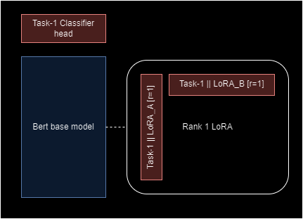

# LoRA-Ensembling

## Trained Bert model with rank-1 LoRA weights

Trained Bert model with rank-1 LoRA weights on `key`, `query`, and `value` weights. Training hyperparameter settings can be found under `hparams/` folder. Training progress can be found on the [wandb report](https://wandb.ai/nikhilchigali/LoRA-Ensembling/reports/Training-LoRA-models--Vmlldzo4NDI2MjM2)

### Tasks
1. [GLUE-SST2](https://huggingface.co/datasets/nyu-mll/glue#sst2-1)
```
sentence: a string feature.
label: a classification label, with possible values including negative (0), positive (1).
idx: a int32 feature.
```

2. [GLUE-CoLA](https://huggingface.co/datasets/nyu-mll/glue#cola-1)
```
sentence: a string feature.
label: a classification label, with possible values including unacceptable (0), acceptable (1).
idx: a int32 feature.
```
3. [GLUE-MNLI](https://huggingface.co/datasets/nyu-mll/glue#mnli-1)
```
premise: a string feature.
hypothesis: a string feature.
label: a classification label, with possible values including entailment (0), neutral (1), contradiction (2).
idx: a int32 feature.
```

### Baseline performance

Bert model is trained with Rank-1 LoRAs on the **Tasks 1 & 2**. The performance baselines are as follows,

| Run                                     | train/loss | val/loss | train/acc | val/acc  |
| --------------------------------------- | ---------- | -------- | --------- | -------- |
| SST2 baseline                           | 0.307144   | 0.331788 | 87.2520   | 84.6330% |
| CoLA baseline                           | 0.235461   | 0.417150 | 91.8305%  | 81.4423% |

### Stacked LoRAs, No further training

| Run                                     | train/loss | val/loss | train/acc | val/acc  |
| --------------------------------------- | ---------- | -------- | --------- | -------- |
| Stacked SST2 (Rank1: SST2, Rank2: CoLA) | 0.475515   | 0.491357 | 78.7643%  | 77.6376% |
| Stacked SST2 (Rank1: SST2, Rank2: CoLA) | 0.475515   | 0.491357 | 78.7643%  | 77.6376% |
| Stacked SST2 (Rank1: SST2, Rank2: CoLA) | 0.475515   | 0.491357 | 78.7643%  | 77.6376% |

Refer to *observations.ipynb* for more details

- Compare performance difference between stacked LoRA's without any further training, on the original tasks.

## Trained stacked LoRAs
```
wandb: Run summary: [Trained on Task 1 for 1 epoch, with (LoRA1, LoRA2) stacked together as X_0]
wandb:               epoch 0
wandb:             lr-Adam 0.0
wandb:           train/acc 0.875
wandb:          train/loss 0.37353
wandb: trainer/global_step 8415
wandb:             val/acc 0.90826
wandb:            val/loss 0.23744
```
```
wandb: Run summary: [Trained on Task 2 for 1 epoch, with (LoRA1, LoRA2) stacked together as X_0]
wandb:               epoch 0
wandb:             lr-Adam 0.0003
wandb:           train/acc 0.75
wandb:          train/loss 0.42605
wandb: trainer/global_step 1067
wandb:             val/acc 0.82019
wandb:            val/loss 0.47149
```
## Work in Progress

- [*To be implemented*] Implement filter/gates for training Mixture of LoRA Experts
- [*To be discussed with prof*] Comparing change in LoRA weights using metrics like Cosine Similarity and subspace similarity. 

  - Measure how far the stacked LoRAs `[LoRA_1, LoRA_2]` have drifted from their baseline `LoRA_1` and `LoRA_2` when trained further and `Task 1` or `Task 2`.
- [*Currently working*] Sequential task learning through rank-1 LoRAs

## Sequential task learning through rank-1 LoRAs

> **Questions:** Training a language model on a downstream `Task 1` using rank-1 LoRA. Can we expand this model further to adapt to another downstream `Task 2`? How much performance are we compromising on `Task 1` by sequentially adapting to a new task?

**Step 1**
- Train the blocks in red (`Task-1` Classifier head and rank 1 LoRA)

- Save the trained classifier and LoRA weights

**Step 2**
- Disable `Task-1` Classifier head and instantiate a new classifier head for `Task-2`
- To the previous LoRA weights, concatenate a new row/column incrementing the rank of the adapter.
  - Rank-1 component corresponds to `Task-1` and the rank-2 component learns `Task-2`
- Train the blocks in red (`Task-2` classifier head, and rank-2 component of the LoRA adapter)


> - When training for `Task-1`, the rank-1 LoRA learns to adapt for the specific task exclusively.
> - When a new task is introduced, a new rank is added to the adapter which has to learn to adapt to this new `Task-2` given `Task-1`'s component in its first rank. 
>   - I want to see how the new rank component would look compared to the first rank. Will it be orthogonal to the rank-1 component? Will the training lead to an adapter with shared subspace for both the tasks?
> - Once trained on `Task-2` while keeping the rank-1 component constant, if we set the `Task-1` classifier head active and re-evaluate, how much of a difference will we see in `Task-1`'s performance? 
>   - One way to switch to running inference for `Task-1` is to use the rank-2 adapter as is and see how it performs
>   - Another way is to mask out all the LoRA components greater than the `Task-1`'s rank to zero. This way we should be able to retain original performance.

*Same process can be extended to additional tasks*